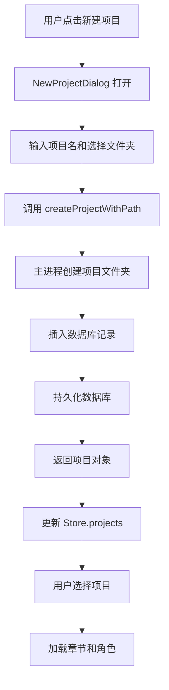
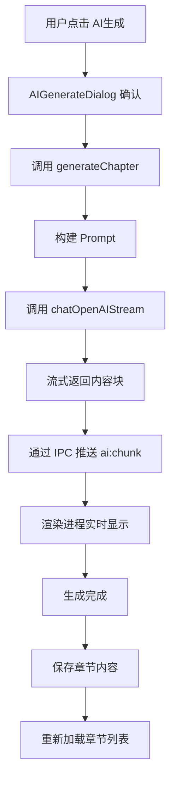
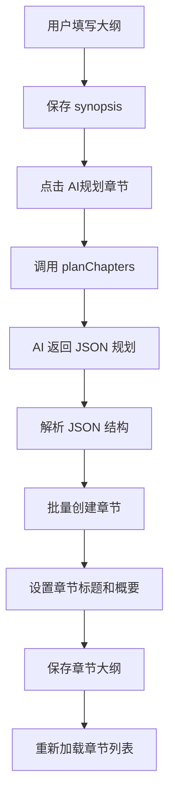

# NovelWriter - Code Wiki

## 项目概述

**NovelWriter** 是一个基于 Electron + React + TypeScript 的 AI 辅助小说创作桌面应用。该项目集成了 OpenAI 和 Ollama 等主流 AI 服务，为作家提供智能化的创作辅助工具。

### 核心特性
- 🎨 富文本与 Markdown 双模式编辑器
- 🤖 AI 续写与章节内容生成
- 📊 智能章节规划与大纲管理
- 👥 角色管理与人物设定
- 🎯 本地 SQLite 数据库存储
- 🌗 深色/浅色主题切换

---

## 目录结构

```
novelwriter/
├── src/
│   ├── main/                 # Electron 主进程
│   │   ├── index.ts         # 应用入口与窗口管理
│   │   ├── ai.ts            # AI 服务集成
│   │   ├── database.ts      # SQLite 数据库管理
│   │   └ ipc.ts            # IPC 通信处理器
│   ├── preload/             # 预加载脚本
│   │   └ index.ts          # 渲染进程 API 桥接
│   ├── renderer/            # 渲染进程 (React 前端)
│   │   ├── src/
│   │   │   ├── store/      # Zustand 状态管理
│   │   │   │   ├── app.ts          # 应用核心状态
│   │   │   │   ├── aiSettings.ts   # AI 配置状态
│   │   │   │   ├── layout.ts       # 布局状态
│   │   │   │   ├── theme.ts        # 主题状态
│   │   │   ├── components/ # React 组件
│   │   │   │   ├── layout/         # 布局组件
│   │   │   │   ├── dialogs/        # 对话框组件
│   │   │   │   ├── ui/             # UI 基础组件
│   │   │   │   ├── TipTapEditor.tsx    # 富文本编辑器
│   │   │   │   ├── OutlinePanel.tsx    # 大纲面板
│   │   │   │   ├── AISettingsPanel.tsx # AI 设置面板
│   │   │   │   ├── AIGenerateDialog.tsx # AI 生成对话框
│   │   │   ├── App.tsx      # 应用根组件
│   │   │   ├── main.tsx     # React 入口
│   │   │   ├── assets/      # 样式资源
├── out/                      # 构建输出目录
├── electron.vite.config.ts  # Electron Vite 配置
├── package.json             # 项目依赖配置
├── tsconfig.json            # TypeScript 配置
└── tailwind.config.js       # TailwindCSS 配置
```

---

## 项目架构

### 技术栈

| 技术领域 | 技术选型 | 版本 | 用途说明 |
|---------|---------|------|---------|
| **桌面框架** | Electron | 33.3.1 | 跨平台桌面应用框架 |
| **前端框架** | React | 18.3.1 | UI 界面构建 |
| **开发语言** | TypeScript | 5.7.0 | 类型安全的 JavaScript |
| **构建工具** | Electron-Vite | 2.3.0 | Electron 专用构建工具 |
| **状态管理** | Zustand | 5.0.3 | 轻量级状态管理库 |
| **富文本编辑** | TipTap | 2.11.5 | 现代化富文本编辑器 |
| **样式方案** | TailwindCSS | 3.4.17 | 实用优先的 CSS 框架 |
| **数据存储** | sql.js | 1.11.0 | SQLite 的 JavaScript 实现 |
| **数据校验** | Zod | 3.24.2 | TypeScript 类型校验库 |
| **图标库** | Lucide React | 1.22.0 | 开源图标库 |
| **布局组件** | react-resizable-panels | 4.12.0 | 可拖拽调整的面板布局 |

### 架构分层

```
┌─────────────────────────────────────────────────────┐
│          渲染进程 (Renderer Process)                 │
│  ┌──────────────┐  ┌──────────────┐  ┌────────────┐│
│  │ React UI 组件 │  │ Zustand Store │  │ TipTap 编辑││
│  └──────────────┘  └──────────────┘  └────────────┘│
└─────────────────────────────────────────────────────┘
         ↕ (IPC Communication via Preload)
┌─────────────────────────────────────────────────────┐
│          主进程 (Main Process)                       │
│  ┌──────────────┐  ┌──────────────┐  ┌────────────┐│
│  │  IPC Handlers │  │ AI Services   │  │ Database   ││
│  └──────────────┘  └──────────────┘  └────────────┘│
└─────────────────────────────────────────────────────┘
```

---

## 核心模块详解

### 1. 主进程模块 (`src/main/`)

#### [index.ts](file:///f:/work/self/hnovel/workspace/novelwriter/src/main/index.ts)

**职责**: 应用生命周期管理、窗口创建、数据库初始化

**关键函数**:
- `createWindow()`: 创建主窗口，配置 WebPreferences
- `app.whenReady()`: 应用启动时初始化数据库和注册 IPC 处理器

**核心流程**:
```typescript
app.whenReady() → initDatabase() → registerHandlers() → createWindow()
```

#### [database.ts](file:///f:/work/self/hnovel/workspace/novelwriter/src/main/database.ts)

**职责**: SQLite 数据库初始化、持久化管理

**数据模型**:
- `Project`: 项目实体 (id, name, description, synopsis, path, createdAt, updatedAt)
- `Chapter`: 章节实体 (id, projectId, title, content, outline, sortOrder, createdAt, updatedAt)
- `Character`: 角色实体 (id, projectId, name, description, traits, createdAt, updatedAt)

**关键函数**:
- `initDatabase()`: 初始化数据库表结构，执行数据库迁移
- `persistDatabase()`: 将内存数据库持久化到文件系统
- `getDatabase()`: 获取数据库实例

**数据库表结构**:
```sql
-- projects 表
CREATE TABLE projects (
  id TEXT PRIMARY KEY,
  name TEXT NOT NULL,
  description TEXT DEFAULT '',
  synopsis TEXT DEFAULT '',
  path TEXT DEFAULT '',
  createdAt TEXT NOT NULL,
  updatedAt TEXT NOT NULL
)

-- chapters 表
CREATE TABLE chapters (
  id TEXT PRIMARY KEY,
  projectId TEXT NOT NULL,
  title TEXT NOT NULL DEFAULT '未命名章节',
  content TEXT DEFAULT '',
  outline TEXT DEFAULT '',
  sortOrder INTEGER NOT NULL DEFAULT 0,
  createdAt TEXT NOT NULL,
  updatedAt TEXT NOT NULL,
  FOREIGN KEY (projectId) REFERENCES projects(id) ON DELETE CASCADE
)

-- characters 表
CREATE TABLE characters (
  id TEXT PRIMARY KEY,
  projectId TEXT NOT NULL,
  name TEXT NOT NULL,
  description TEXT DEFAULT '',
  traits TEXT DEFAULT '',
  createdAt TEXT NOT NULL,
  updatedAt TEXT NOT NULL,
  FOREIGN KEY (projectId) REFERENCES projects(id) ON DELETE CASCADE
)
```

#### [ipc.ts](file:///f:/work/self/hnovel/workspace/novelwriter/src/main/ipc.ts)

**职责**: IPC 通信处理器注册、业务逻辑实现

**核心处理器组**:
- `registerProjectHandlers()`: 项目 CRUD 操作
- `registerChapterHandlers()`: 章节管理
- `registerCharacterHandlers()`: 角色管理
- `registerDialogHandlers()`: 文件对话框
- `registerAIOutineHandlers()`: AI 大纲与章节生成

**关键 IPC 接口**:
| IPC 通道 | 功能说明 | 参数 |
|---------|---------|------|
| `project:create` | 创建项目 | name |
| `project:createWithPath` | 创建项目并指定路径 | name, folderPath |
| `project:save` | 保存项目 | Partial<Project> |
| `chapter:save` | 保存章节 | Partial<Chapter> |
| `chapter:create` | 创建章节 | projectId |
| `ai:generateChapter` | AI 生成章节内容 | projectId, chapterId, synopsis, ... |
| `ai:planChapters` | AI 规划章节结构 | synopsis, numChapters |

**工具函数**:
- `queryOne<T>()`: 执行单行查询
- `queryAll<T>()`: 执行多行查询
- `runQuery()`: 执行写入操作

#### [ai.ts](file:///f:/work/self/hnovel/workspace/novelwriter/src/main/ai.ts)

**职责**: AI 服务集成、API 调用封装

**配置模型**:
```typescript
interface AIConfig {
  provider: 'openai' | 'ollama'
  apiKey?: string
  baseUrl: string
  model: string
}
```

**核心函数**:
- `chatOpenAI()`: 调用 OpenAI API (非流式)
- `chatOpenAIStream()`: 调用 OpenAI API (流式响应)
- `chatOllama()`: 调用 Ollama API (支持流式)
- `registerAIHandlers()`: 注册 AI 相关 IPC 处理器

**流式响应处理**:
通过 `AbortSignal` 支持取消请求，通过 IPC 向渲染进程实时推送内容块 (`ai:chunk`)。

---

### 2. 预加载脚本 (`src/preload/index.ts`)

**职责**: 桥接主进程与渲染进程，暴露安全的 API 接口

**API 暴露结构**:
```typescript
const api = {
  // 项目管理
  createProject, openProject, listProjects, saveProject, deleteProject,
  
  // 章节操作
  getChapters, saveChapter, deleteChapter, createChapter,
  
  // 角色操作
  getCharacters, saveCharacter, deleteCharacter,
  
  // 文件对话框
  showOpenDialog, showSaveDialog, selectFolder,
  
  // 项目管理(含文件夹)
  createProjectWithPath,
  
  // AI 功能
  aiChat, onAiChunk, saveAIConfig, getAIConfig,
  
  // 大纲管理
  saveProjectSynopsis, saveChapterOutline,
  
  // AI 生成
  generateChapter, planChapters
}
```

**关键特性**:
- 使用 `contextBridge.exposeInMainWorld()` 安全暴露 API
- 所有通信通过 `ipcRenderer.invoke()` 和 `ipcRenderer.on()` 实现
- 提供取消监听的清理函数

---

### 3. 渲染进程模块 (`src/renderer/`)

#### 状态管理 (`src/renderer/src/store/`)

##### [app.ts](file:///f:/work/self/hnovel/workspace/novelwriter/src/renderer/src/store/app.ts)

**职责**: 应用核心状态管理

**状态结构**:
```typescript
interface AppState {
  projects: Project[]           // 项目列表
  currentProject: Project | null // 当前活动项目
  chapters: Chapter[]           // 章节列表
  currentChapter: Chapter | null // 当前编辑章节
  characters: Character[]       // 角色列表
  editorContent: string         // 编辑器内容
  editorMode: 'richtext' | 'markdown' // 编辑模式
}
```

**核心操作**:
- `loadProjects()`: 加载所有项目
- `loadChapters()`: 加载指定项目的章节
- `loadCharacters()`: 加载角色列表
- `saveCurrentChapter()`: 保存当前章节内容
- `aiGenerateChapter()`: AI 生成章节内容
- `aiPlanChapters()`: AI 规划章节结构

##### [aiSettings.ts](file:///f:/work/self/hnovel/workspace/novelwriter/src/renderer/src/store/aiSettings.ts)

**职责**: AI 配置管理

**状态结构**:
```typescript
interface AISettingsState {
  showSettings: boolean
  config: AIConfig
}
```

**核心操作**:
- `loadConfig()`: 加载 AI 配置
- `saveConfig()`: 保存 AI 配置到主进程

##### [layout.ts](file:///f:/work/self/hnovel/workspace/novelwriter/src/renderer/src/store/layout.ts)

**职责**: 布局状态管理

**状态结构**:
```typescript
type SidebarView = 'project' | 'characters' | 'outline'

interface LayoutState {
  sidebarView: SidebarView
}
```

##### [theme.ts](file:///f:/work/self/hnovel/workspace/novelwriter/src/renderer/src/store/theme.ts)

**职责**: 主题切换管理

**核心特性**:
- 支持 'light' 和 'dark' 两种主题
- 自动同步到 localStorage 和 DOM 属性
- 初始化时恢复用户偏好

#### 核心组件 (`src/renderer/src/components/`)

##### [TipTapEditor.tsx](file:///f:/work/self/hnovel/workspace/novelwriter/src/renderer/src/components/TipTapEditor.tsx)

**职责**: 富文本编辑器核心组件

**关键特性**:
- 基于 TipTap 框架构建
- 支持标题、加粗、斜体、下划线、删除线等格式
- 支持列表、引用、代码块
- 支持撤销/重做操作
- 实时内容同步到父组件

**编辑器扩展**:
```typescript
extensions: [
  StarterKit,      // 基础扩展集
  Underline,       // 下划线扩展
  Placeholder      // 占位提示
]
```

##### [OutlinePanel.tsx](file:///f:/work/self/hnovel/workspace/novelwriter/src/renderer/src/components/OutlinePanel.tsx)

**职责**: 大纲规划与章节管理面板

**核心功能**:
- 小说大纲 (synopsis) 编辑与保存
- 章节大纲编辑与保存
- AI 自动规划章节结构
- AI 根据大纲生成章节内容

**关键交互**:
- `handleSaveSynopsis()`: 保存项目大纲
- `handlePlanChapters()`: 调用 AI 规划章节
- `runGenerateChapter()`: 调用 AI 生成章节内容

##### [Sidebar.tsx](file:///f:/work/self/hnovel/workspace/novelwriter/src/renderer/src/components/layout/Sidebar.tsx)

**职责**: 项目与章节导航侧边栏

**核心功能**:
- 项目列表展示与切换
- 章节列表展示与切换
- 新建项目与新建章节
- 删除项目与删除章节

**交互逻辑**:
- 点击项目 → 加载章节和角色
- 点击章节 → 切换编辑器内容
- Hover 显示删除按钮

##### [App.tsx](file:///f:/work/self/hnovel/workspace/novelwriter/src/renderer/src/App.tsx)

**职责**: 应用主界面布局与核心逻辑

**布局结构**:
```
TitleBar (标题栏)
├─ ActivityBar (活动栏)
├─ PanelGroup (三列布局)
│  ├─ Sidebar (项目/章节树)
│  ├─ Editor (编辑器)
│  └─ Right Panel (角色/大纲)
└─ StatusBar (状态栏)
```

**核心功能**:
- 角色管理 (添加、编辑、删除)
- AI 续写功能
- 编辑模式切换 (富文本/Markdown)
- 章节保存

---

## 数据流与通信机制

### IPC 通信流程

```
渲染进程 (React Component)
   ↓ 调用 window.api.xxx()
预加载脚本 (contextBridge)
   ↓ ipcRenderer.invoke('channel', args)
主进程 (IPC Handler)
   ↓ 处理业务逻辑
数据库/AI 服务
   ↓ 返回结果
渲染进程 (更新 Store)
```

### 数据持久化流程

```
用户编辑内容
   ↓ onUpdate 回调
App Store (setEditorContent)
   ↓ saveCurrentChapter()
window.api.saveChapter(data)
   ↓ IPC 通信
主进程 IPC Handler
   ↓ SQL 操作
Database (SQLite 内存)
   ↓ persistDatabase()
文件系统 (novelwriter.db)
```

---

## 关键业务流程

### 1. 创建项目流程



### 2. AI 章节生成流程



### 3. AI 章节规划流程



---

## 依赖关系图谱

### 运行时依赖

```
React 生态系统:
  react → react-dom → @tiptap/react → @tiptap/core
  zustand → 状态管理
  react-resizable-panels → 面板布局

Electron 生态系统:
  electron → @electron-toolkit/utils → @electron-toolkit/preload
  electron-vite → 构建工具

数据与验证:
  sql.js → SQLite 数据库
  zod → 数据校验

样式与 UI:
  tailwindcss → postcss → autoprefixer
  lucide-react → 图标库

AI 服务:
  fetch API → OpenAI/Ollama API
```

### 开发依赖

```
TypeScript 工具链:
  typescript → tsconfig 配置
  @types/react → @types/react-dom

构建工具:
  vite → @vitejs/plugin-react
  electron-vite → electron-builder
```

---

## 配置文件详解

### [electron.vite.config.ts](file:///f:/work/self/hnovel/workspace/novelwriter/electron.vite.config.ts)

**三进程构建配置**:
- **main**: 主进程构建，输出到 `out/main/`
- **preload**: 预加载脚本构建，输出到 `out/preload/`
- **renderer**: 渲染进程构建，输出到 `out/renderer/`

**关键配置**:
```typescript
{
  main: {
    plugins: [externalizeDepsPlugin()],  // 外部化依赖
    build: { outDir: 'out/main' }
  },
  preload: {
    plugins: [externalizeDepsPlugin()],
    build: { outDir: 'out/preload' }
  },
  renderer: {
    plugins: [react()],
    resolve: { alias: { '@': 'src/renderer/src' } }
  }
}
```

### [package.json](file:///f:/work/self/hnovel/workspace/novelwriter/package.json)

**关键脚本**:
- `npm run dev`: 启动开发模式
- `npm run build`: 构建生产版本
- `npm run preview`: 预览构建结果

**应用元数据**:
```json
{
  "name": "novelwriter",
  "version": "1.0.0",
  "description": "AI 辅助写小说桌面应用",
  "main": "./out/main/index.js",
  "type": "module"
}
```

---

## 运行与构建指南

### 开发环境运行

```bash
# 安装依赖
npm install

# 启动开发模式
npm run dev
```

**开发模式特性**:
- 自动打开 DevTools
- 热模块替换 (HMR)
- 实时编译 TypeScript

### 生产构建

```bash
# 构建应用
npm run build

# 预览构建结果
npm run preview
```

**构建输出**:
- `out/main/index.js`: 主进程入口
- `out/preload/index.mjs`: 预加载脚本
- `out/renderer/index.html`: 渲染进程入口

### 数据存储位置

数据库文件存储在用户数据目录:
```
Windows: C:\Users\<用户名>\AppData\Roaming\novelwriter\novelwriter.db
macOS: ~/Library/Application Support/novelwriter/novelwriter.db
Linux: ~/.config/novelwriter/novelwriter.db
```

---

## 扩展与定制指南

### 添加新的 IPC 通道

1. 在 [ipc.ts](file:///f:/work/self/hnovel/workspace/novelwriter/src/main/ipc.ts) 中注册处理器:
```typescript
export function registerNewHandlers(): void {
  ipcMain.handle('new:action', (_event, args) => {
    // 实现业务逻辑
    return result
  })
}
```

2. 在 [preload/index.ts](file:///f:/work/self/hnovel/workspace/novelwriter/src/preload/index.ts) 中暴露 API:
```typescript
newAction: (args) => ipcRenderer.invoke('new:action', args)
```

3. 在主进程入口注册处理器:
```typescript
registerNewHandlers()
```

### 扩展编辑器功能

在 [TipTapEditor.tsx](file:///f:/work/self/hnovel/workspace/novelwriter/src/renderer/src/components/TipTapEditor.tsx) 中添加扩展:
```typescript
import NewExtension from '@tiptap/extension-new'

extensions: [
  StarterKit,
  Underline,
  Placeholder,
  NewExtension  // 新扩展
]
```

### 添加新的 AI 服务提供商

在 [ai.ts](file:///f:/work/self/hnovel/workspace/novelwriter/src/main/ai.ts) 中添加:
```typescript
export async function chatNewProvider(
  messages: ChatMessage[],
  signal?: AbortSignal
): Promise<string> {
  // 实现新的 AI 服务调用
}
```

---

## 技术亮点

### 1. 三进程架构分离
通过 Electron-Vite 实现主进程、预加载脚本、渲染进程的独立构建，确保代码隔离与安全。

### 2. 类型安全的状态管理
使用 Zustand 配合 TypeScript 接口定义，实现类型安全的状态管理。

### 3. 流式 AI 响应处理
通过 IPC 实时推送 AI 生成的文本块，提供流畅的用户体验。

### 4. 本地优先的数据存储
使用 sql.js 实现 SQLite 数据库，确保数据隐私与快速访问。

### 5. 响应式布局设计
使用 react-resizable-panels 实现可拖拽调整的三列布局。

---

## 待优化方向

### 功能增强
- [ ] 支持导出为 PDF/Word 格式
- [ ] 实现版本历史与回滚
- [ ] 添加多语言支持
- [ ] 实现云端同步功能

### 性能优化
- [ ] 大文档编辑性能优化
- [ ] 数据库查询优化
- [ ] AI 响应缓存机制

### 架构改进
- [ ] 引入错误边界 (Error Boundary)
- [ ] 完善单元测试覆盖
- [ ] 实现插件化架构

---

## 联系与贡献

项目基于 MIT 协议开源，欢迎提交 Issue 和 Pull Request。

**项目仓库**: `f:\work\self\hnovel\workspace\novelwriter`

---

*文档生成时间: 2026-07-02*
*文档版本: 1.0*